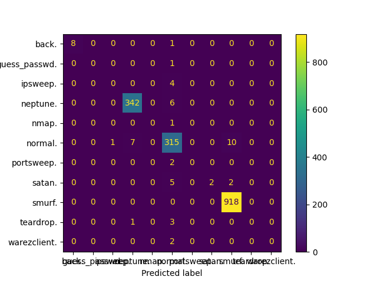

# BMT310-Grup1-DDoS_Mitigation_With_AI
BMT310-Grup1-DDoS_Mitigation_With_AI

## Kdd99 Veri Seti İnceleme ve Ön İşleme

öğrenme algoritmaları büyük verileri işleyerek ilerde karşılaşacakları örneklerin çıktılarını tahmin etmeye çalışırlar.
bu tahmini matematiksel işlemlerle yaparlar. dolayısıyla, verilerin algoritmalar tarafından anlaşılır olması 
için sayısal veri olması gerekir.

Bizim alt problemimiz ise ddos saldırılarını sınıflandırmak. 

Kdd99 veri setinde 3 kolon kategorik veri içeriyor bunlar: 
protocol_type, 
flag, 
service 
Bu kolonları sayısal verilere çeviriyoruz.

### Örnek olarak

## Tahminler

### Decision tree

#### Doğruluk matrisi (confusion matrix)

#### DOĞRULUK ORANI
0.9951

### KNN k nearest neighbors

#### Doğruluk matrisi (confusion matrix)

#### DOĞRULUK ORANI
0.9755
