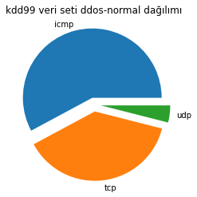

## Veri ve Yapay Zeka 

### Veri Dağılımları

kdd99 veri setindeki protocol tipi dağılımı

---
kdd99 veri setindeki ddos-normal trafik dağılımı

### Eğitilmiş Modellerin Kullanılması

google colab üzerinde yaptığımız eğitimler sonucunda elde ettiğimiz modelleri `pickle` modülünü kullanarak dosyaya yazdık ve indirdik. Sonrasında yerel bilgisayarlarımızda çalıştırmak için `egitilmis_model_controller` kullandık [buradan inceleyebilirsiniz](egitilmis_modeller/egitilmis_model_controller.py). Bu sayede model okuma işini sadece bir sınıfa vermiş olduk.